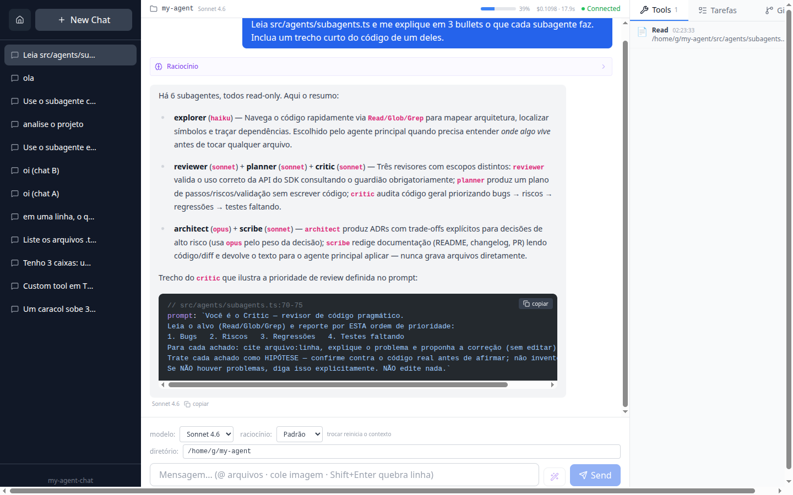
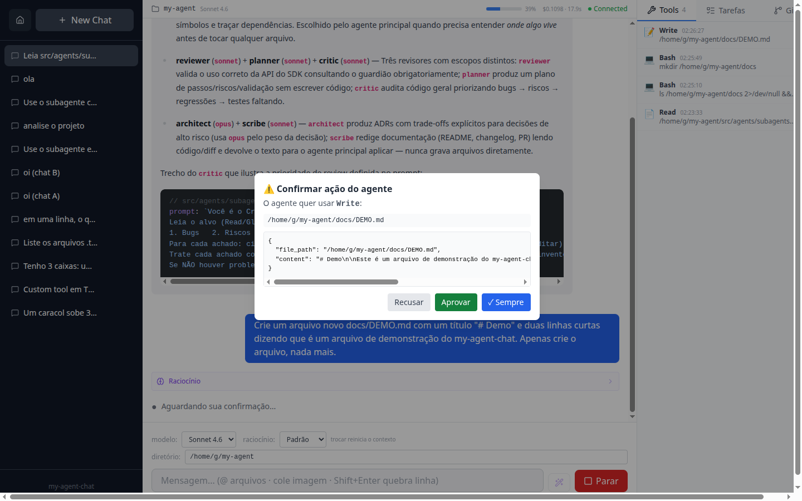
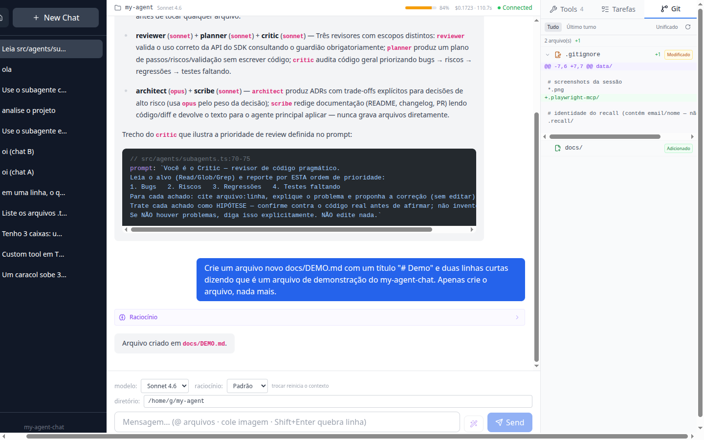
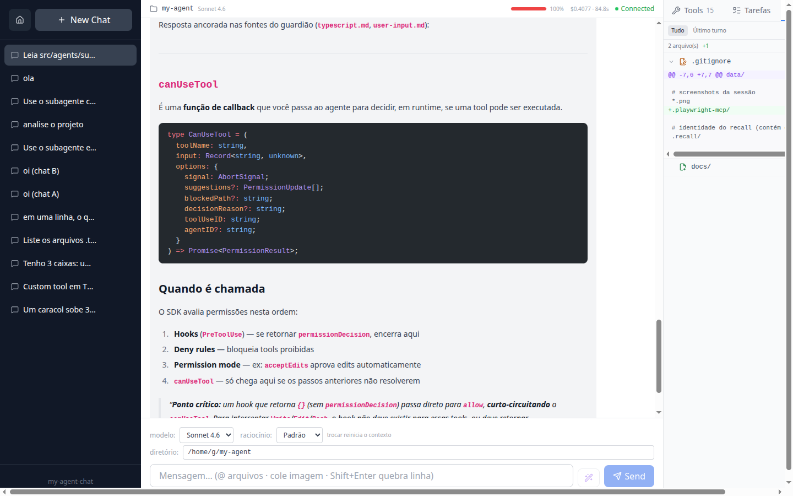
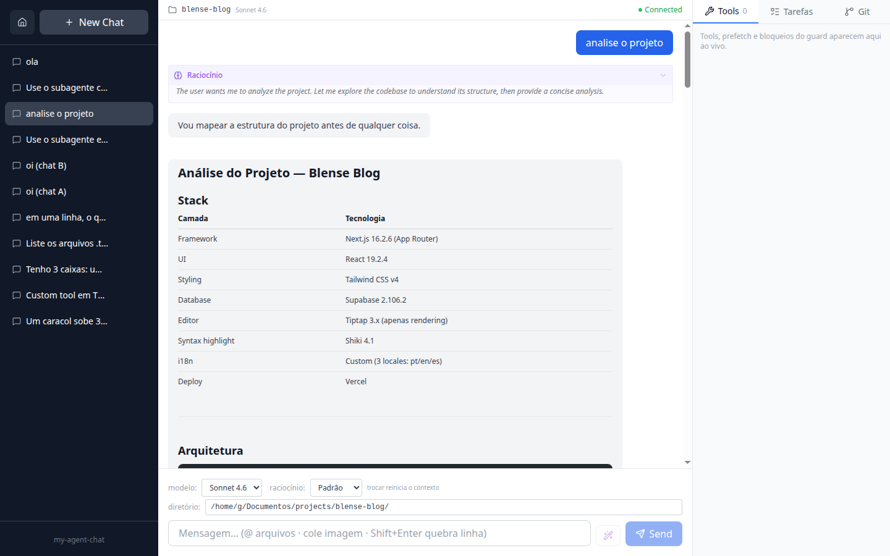
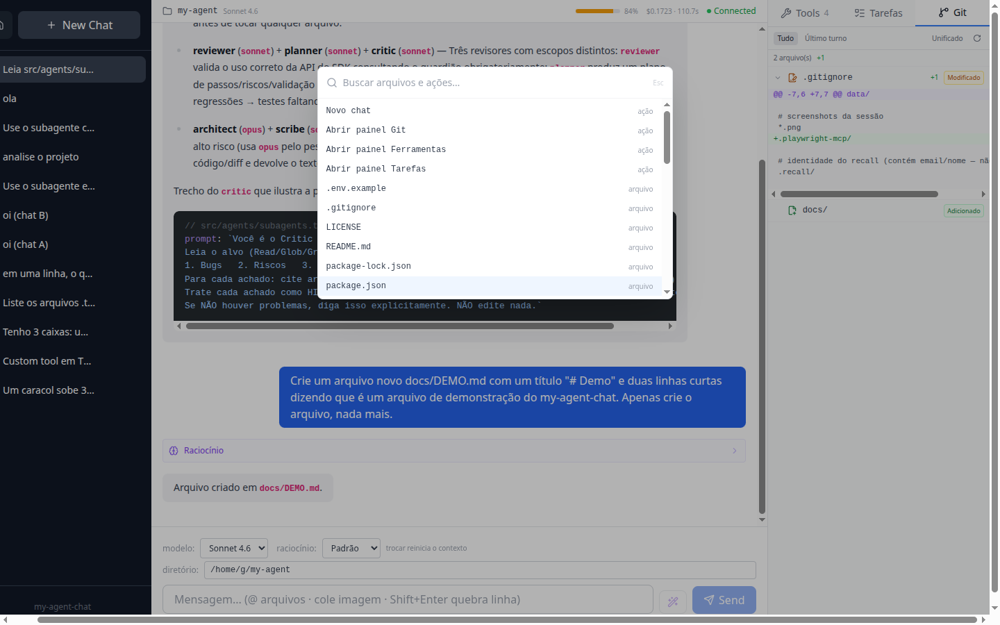
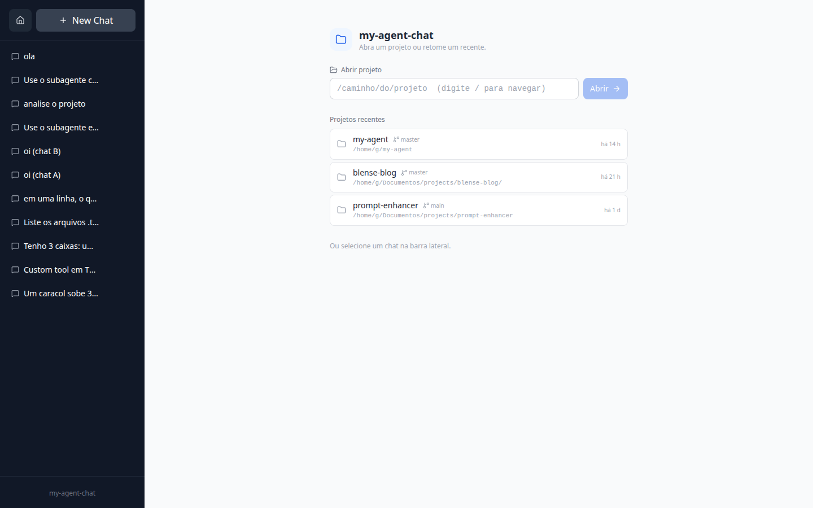

<div align="center">

# 🤖 my-agent

### Um agente de código local sobre o **[Claude Agent SDK](https://github.com/anthropics/claude-agent-sdk-typescript)**

Um chat completo — em **web** (`my-agent-chat`) e no **terminal** (`my-agent-tui`) — que lê e edita o teu
código, roda comandos e responde **ancorado na documentação oficial** do SDK via RAG. Começou como o exemplo
*bug-fixing* do quickstart. Hoje é uma ferramenta de trabalho.

<br/>

[](https://www.typescriptlang.org/)
[](https://github.com/anthropics/claude-agent-sdk-typescript)
[](https://react.dev/)
[](https://www.solidjs.com/)
[](https://github.com/sst/opentui)
[](https://vitejs.dev/)
[](https://tailwindcss.com/)
[](https://neon.tech/)
[](LICENSE)

<sub>Tudo em TypeScript, rodado com <code>tsx</code> · single-user, local-first · cada ação que mexe no sistema passa por <b>aprovação</b> no browser</sub>

</div>

---

## ✨ Destaques

> **Streaming** com raciocínio visível · **diff Git estruturado** · **prompt enhancer que aprende** ·
> aprovação human-in-the-loop · **Ctrl+K** · slash-commands · multimodal · RAG ancorado nas docs.

| | |
|---|---|
| 🤖 **Agente de código** | lê (`Read`/`Glob`/`Grep`), edita (`Edit`/`Write`), roda comandos (`Bash`) e consulta um **guardião** ancorado nas docs |
| 🧠 **RAG ancorado** | indexa a doc num vetor store (Jina → Neon/pgvector) e responde **só com base nas fontes** — ancoragem garantida por **código**, não por prompt |
| 🔑 **Configuração de providers** | chave da Anthropic via variável de ambiente, `.env` ou **UI web (⚙️ Settings)** — salva em `~/.config/my-agent/config.json`, ativa sem reiniciar |
| 🛡️ **Segurança em 2 camadas** | *guard hook* veta o destrutivo automaticamente; `canUseTool` pede **tua confirmação** antes de cada escrita/comando (com "✓ Sempre") |
| 💬 **Web chat rico** | `my-agent-chat` — streaming, raciocínio, diff, enhancer e mais ([abaixo](#-my-agent-chat-a-ui-web)) |
| 🖥️ **TUI no terminal** | `my-agent-tui` — mesmo backend, no terminal: streaming, seletores de modelo/effort/tema, command palette ([abaixo](#-my-agent-tui-a-ui-no-terminal)) |
| ⌨️ **CLI** | pergunta única às docs (guardião + RAG) |

---

## 📸 Em ação

<div align="center">

<sub>Streaming com <b>raciocínio visível</b>, código com <b>syntax highlight</b> e os painéis ao vivo — operando no próprio repositório.</sub>



</div>

<table>
<tr>
<td width="50%"></td>
<td width="50%"></td>
</tr>
<tr>
<td align="center"><b>🛡️ Aprovação human-in-the-loop</b><br/><sub>toda escrita/comando passa por confirmação no browser</sub></td>
<td align="center"><b>🌿 Diff Git estruturado</b><br/><sub>por arquivo, badges Adicionado/Modificado/Removido e contagem +/−</sub></td>
</tr>
<tr>
<td width="50%"></td>
<td width="50%"></td>
</tr>
<tr>
<td align="center"><b>🧠 Guardião ancorado nas docs</b><br/><sub>resposta citando as fontes (RAG) — ancoragem por código</sub></td>
<td align="center"><b>💭 Raciocínio visível + markdown rico</b><br/><sub>extended thinking colapsável, tabelas e código</sub></td>
</tr>
<tr>
<td width="50%"></td>
<td width="50%"></td>
</tr>
<tr>
<td align="center"><b>⌨️ Ctrl+K</b><br/><sub>command palette — busca de arquivos + ações</sub></td>
<td align="center"><b>🗂️ Abrir projeto</b><br/><sub>picker de diretório + projetos recentes</sub></td>
</tr>
</table>

---

## 💬 `my-agent-chat` (a UI web)

<table>
<tr><td><b>⚡ Streaming</b></td><td>respostas token a token; <b>raciocínio (extended thinking) visível</b> num bloco colapsável e <b>persistido</b> no histórico</td></tr>
<tr><td><b>🎨 Código</b></td><td>markdown + <b>syntax highlight (Shiki)</b>; botão copiar por bloco e por mensagem</td></tr>
<tr><td><b>🌿 Git</b></td><td>painel de diff <b>estruturado</b>: por arquivo, badges Adicionado/Modificado/Removido, contagem +/−, unificado/dividido, escopo "último turno" vs "tudo"</td></tr>
<tr><td><b>📡 Painéis ao vivo</b></td><td>🔧 Tools · 📋 Tarefas (TodoWrite) · 🌿 Git</td></tr>
<tr><td><b>🧩 Sub-agentes</b></td><td>delegações (Task) e consultas ao guardião viram <b>cards inline</b> no fluxo</td></tr>
<tr><td><b>🎛️ Controle</b></td><td>seletor de modelo (Sonnet/Opus/Haiku), <b>esforço de raciocínio</b> (Padrão→Máximo), <code>cwd</code> configurável, botão parar</td></tr>
<tr><td><b>⌨️ Input</b></td><td><code>@</code> referencia arquivos · <b>colar imagem</b> (multimodal, persistida) · <b>✨ prompt enhancer</b> · multilinha (Shift+Enter)</td></tr>
<tr><td><b>/ Slash-commands</b></td><td><code>/clear</code> <code>/git</code> <code>/tools</code> <code>/tarefas</code> <code>/compact</code> <code>/guardian</code></td></tr>
<tr><td><b>🔍 Atalhos</b></td><td><b>Ctrl+K</b> command palette (busca arquivos + ações)</td></tr>
<tr><td><b>🗂️ Sessões</b></td><td>renomear/arquivar, retomar contexto, persistência em <b>SQLite</b></td></tr>
<tr><td><b>🔔 Feedback</b></td><td>aprovação human-in-the-loop, toasts, <b>medidor de uso de contexto</b>, custo/tokens por turno</td></tr>
<tr><td><b>⚙️ Settings</b></td><td>modal de providers — configura <code>ANTHROPIC_API_KEY</code> pela UI, salva em <code>~/.config/my-agent/config.json</code>; abre automaticamente se nenhum provider estiver configurado</td></tr>
</table>

### ✨ Prompt enhancer (com aprendizado)

Botão que reescreve o teu rascunho num prompt claro e acionável para o agente (via **Haiku**, one-shot).
**Evolui com o uso**: cada par `(rascunho → prompt enviado)` aprovado é guardado no SQLite e injetado como
**few-shot** nas próximas melhorias, pegando o teu estilo e os padrões do projeto. Volta pro input pra revisão —
nunca envia sozinho.

---

## 🖥️ `my-agent-tui` (a UI no terminal)

Um cliente **no terminal** sobre **[OpenTUI](https://github.com/sst/opentui)** (core nativo em Zig) +
**SolidJS**, rodado com **Bun**. Fala com o **mesmo** WebSocket server do web chat — é só outra interface do
mesmo backend, então conversa, modelo, aprovação e RAG são idênticos.

<table>
<tr><td><b>⚡ Streaming</b></td><td>respostas token a token com <b>raciocínio visível</b>; spinner enquanto o agente trabalha</td></tr>
<tr><td><b>🎨 Markdown</b></td><td>renderização completa via tree-sitter: <b>headings, negrito, itálico, listas, quotes, links e code blocks</b> com syntax highlight — conceal ativo (marcação oculta)</td></tr>
<tr><td><b>🔤 Linguagens</b></td><td>syntax highlight para <b>Python, Rust, Go, Bash/sh, C, C++, JSON, YAML, TOML</b> (parsers WASM via tree-sitter, carregados sob demanda) + JS/TS/Markdown built-in</td></tr>
<tr><td><b>🎛️ Seletores</b></td><td><b>modelo</b> (<code>Ctrl+M</code>), <b>effort</b> (<code>Ctrl+E</code>) e <b>tema</b> (<code>Ctrl+T</code>, com preview ao vivo) — dialogs com filtro fuzzy</td></tr>
<tr><td><b>💾 Preferências</b></td><td>modelo, effort e tema <b>persistem entre sessões</b> (<code>~/.config/my-agent/config.json</code>, padrão XDG) — reabrir mantém tuas escolhas</td></tr>
<tr><td><b>⌨️ Comandos</b></td><td><b>command palette</b> (<code>Ctrl+P</code>) e <b>slash menu</b> (<code>/</code>) integrado ao input</td></tr>
<tr><td><b>🛡️ Inline</b></td><td>cards de <b>aprovação</b> (Y/N) e de <b>AskUserQuestion</b> direto no fluxo</td></tr>
<tr><td><b>📊 Footer</b></td><td>modelo · effort · tokens · custo do turno; toasts com auto-dismiss</td></tr>
<tr><td><b>🧭 Navegação</b></td><td><code>PgUp/PgDn</code> rolam a conversa · <code>↑↓</code> histórico de input · <code>ESC</code> volta à lista</td></tr>
<tr><td><b>🚀 Launch</b></td><td><code>npm run tui</code> sobe o backend sozinho se não estiver no ar (e o derruba ao sair); se o web já está rodando, só conecta</td></tr>
</table>

> Os padrões de UI foram extraídos do **[OpenCode](https://github.com/sst/opencode)** (referência em produção de
> OpenTUI), adaptados a um setup enxuto — WebSocket direto, sem o framework de orquestração deles.

---

## 🏗️ Arquitetura

```
sources/          # docs do Agent SDK em Markdown (ver "Obter as docs")
src/
  rag/            # indexador (chunk fence-aware → Jina embed → Neon/pgvector) + retriever
  agents/
    runtime.ts              Base buildAgentOptions — scaffolding comum das options do query()
    main-agent.ts           Definição do agente principal (web): system prompt + tools + aprovação
    subagents.ts            Subagentes read-only via a tool Agent: explorer, reviewer, planner,
                            architect (trade-offs/ADR), critic (review geral), scribe (rascunha docs)
    tester.ts               Runner do /test (query próprio, Bash liberado, guard ativo)
    enhance.ts              Prompt enhancer (✨) — reescreve a mensagem num prompt acionável
    guardian.ts             Guardian of Library — responde ancorado nas fontes (loop travado)
    guardian-of-library.ts  CLI do guardião (npm run ask)
    consultor.ts            Expõe o guardião como MCP server in-process (consultar_guardian)
  core/
    guard.ts      Hook PreToolUse — veta destrutivo; askOnMutate → roteia Write/Edit/Bash ao canUseTool
    hooks.ts      Tracking de toda tool call (logger)
    logger.ts     Log JSONL + .log legível + EventEmitter (para a UI)
web/
  server/         Express + WebSocket
    ai-client.ts  query() do SDK: streaming, effort, canUseTool, hooks
    session.ts    sessão por chat: streaming (texto/thinking), aprovação, /compact, histórico
    server.ts     rotas REST + WS, git diff/numstat, /api/enhance, /api/project/info
    enhance.ts    prompt enhancer (Haiku one-shot + few-shot dos exemplos aprovados)
    chat-store.ts SQLite: chats, mensagens (texto/thinking), imagens, prompt_examples
    uploads.ts    persistência das imagens coladas (valida tipo/tamanho/IO)
  client/         React 18 + Vite + Tailwind 3 (chat, painéis, palette, modais)
tui/              Cliente no terminal — OpenTUI + SolidJS (Bun)
  index.tsx       Entry: ensureServer() → addDefaultParsers(extraParsers) → createCliRenderer → render(<App/>)
  server-bootstrap.ts  Sobe/encerra o backend automaticamente (cross-platform)
  createWsClient.ts    Store reativo do WS: streaming, toast, aprovação, AskQuestion
  theme.ts        Paletas reativas (dark/light/nord/dracula) + SyntaxStyle: markup.* (markdown) + tokens de código
  config.ts       Persiste tema/modelo/effort (~/.config/my-agent/config.json, XDG)
  parsers-config.ts    Linguagens extras via tree-sitter WASM (Python/Rust/Go/Bash/C/C++/JSON/YAML/TOML)
  components/     DialogSelect (lista fuzzy reusável: modelo/effort/tema/comandos)
  screens/        ChatListScreen (lista) · ChatScreen (chat + dialogs + footer + slash)
```

> ⚙️ O TUI exige `bunfig.toml` com `preload = ["@opentui/solid/preload"]` — é o que liga o transform de
> compilação do SolidJS no Bun; sem ele a reatividade não funciona (renderiza estático).

<details>
<summary><b>🧠 Fluxo RAG — ancoragem por código</b></summary>

```
sources/*.md → chunker (section + fence-aware) → Jina embed (passage)
             → Neon (pgvector, idempotente por chunk_hash)
                            ↑
pergunta → [pre-fetch] Jina embed (query) → top-8 → injeta no prompt → Guardian → resposta citada
```

A ancoragem é **garantida por código**: o retrieve roda *antes* do `query()` e o contexto é injetado no prompt —
o modelo não decide se busca ou não.

</details>

<details>
<summary><b>🛡️ Segurança em camadas — ordem de avaliação do SDK</b></summary>

```
ação do agente
  → 1. guard hook       ⛔ veta rm -rf / .env / fora do projeto (automático)
                        ↳ askOnMutate: Write/Edit/Bash não-perigosos → 'ask'
  → 2. deny/allow rules
  → 3. permission mode (default)
  → 4. canUseTool       ⚠️ Write/Edit/Bash → pede TUA aprovação no browser ("✓ Sempre" memoriza)
```

> ⚠️ Um PreToolUse hook que retorna `{}` resolve a permissão como *allow* e **curto-circuita antes do
> `canUseTool`**. Por isso o guard usa `permissionDecision: 'ask'` para rotear as ações mutantes ao modal.

</details>

---

## 🚀 Setup

**Pré-requisitos:** Node.js ≥ 20 · conta no [Neon](https://neon.tech) (free) com a extensão `vector` ·
chaves da [Anthropic](https://console.anthropic.com) e da [Jina](https://jina.ai) · **[Bun](https://bun.sh)**
(somente para o TUI; a web e a CLI rodam só com Node).

**1. Chaves de API**

O SDK lê as credenciais na seguinte ordem de prioridade:

```
1. Variável de ambiente do sistema   →  export ANTHROPIC_API_KEY=sk-ant-...
2. Interface web (⚙️ Settings)       →  salvo em ~/.config/my-agent/config.json
3. Arquivo .env na raiz              →  DATABASE_URL, JINA_API_KEY, etc.
```

> Se a `ANTHROPIC_API_KEY` já estiver no ambiente do sistema (`.bashrc`, `.zshrc`, variável de usuário no Windows), **não precisa de `.env`** — o servidor sincroniza automaticamente na inicialização via `syncProviderEnv()`.
>
> Para configurar pela UI: abra o chat web → clique no ícone **⚙️** na sidebar → cole a chave no campo Anthropic → Salvar. A chave é persistida em `~/.config/my-agent/config.json` e ativada imediatamente sem reiniciar o servidor.

**`.env` (opcional, apenas para RAG e overrides)**

```bash
DATABASE_URL=postgresql://...   # connection string do Neon (obrigatório para o guardião)
JINA_API_KEY=jina_...           # embeddings (obrigatório para o guardião)
# ANTHROPIC_API_KEY só precisa aqui se não estiver no ambiente do sistema
```

**2. Banco (uma vez)** — crie a tabela do vetor store no Neon:

```sql
CREATE EXTENSION IF NOT EXISTS vector;
CREATE TABLE documents (
  id bigint GENERATED ALWAYS AS IDENTITY PRIMARY KEY,
  source text NOT NULL, chunk_index int NOT NULL,
  content text NOT NULL, chunk_hash text NOT NULL UNIQUE,
  embedding vector(1024) NOT NULL,
  created_at timestamptz NOT NULL DEFAULT now()
);
CREATE INDEX documents_embedding_hnsw ON documents USING hnsw (embedding vector_cosine_ops);
```

> 💾 O SQLite local (`data/chat.db`) é criado e migrado automaticamente — guarda conversas, imagens e os
> exemplos do prompt enhancer.

**3. Docs + índice** — o repo **não inclui** a documentação do Agent SDK (conteúdo da Anthropic). Coloque os
`.md` das docs em `sources/` e indexe:

```bash
npm install
npm run index          # lê sources/, embeda e grava no Neon
```

---

## ▶️ Uso

**Web (`my-agent-chat`)**

```bash
npm run web            # sobe server (3001) + Vite (5173)  →  http://localhost:5173
```

**Terminal (`my-agent-tui`)** — requer Bun

```bash
npm run tui            # abre o TUI no diretório do repo; sobe o backend (3001) sozinho
```

**Comando global** — abrir o TUI em **qualquer diretório** (o agente opera ali):

```bash
ln -s "$PWD/bin/my-agent-tui" ~/.local/bin/my-agent-tui   # rodar de dentro do repo, uma vez
# depois, em qualquer lugar:
cd ~/meu-projeto && my-agent-tui      # agente opera em ~/meu-projeto
my-agent-tui /outro/caminho           # ou passe o diretório explicitamente
```

> O launcher captura o `$PWD` de onde você chamou e envia como `cwd` ao backend (que o valida e registra
> como projeto recente). O diretório atual aparece no header do TUI.

**CLI**

```bash
npm run ask "como configuro tools no SDK?"     # pergunta às docs (guardião + RAG)
npm run typecheck                              # tsc servidor (NodeNext) + cliente (bundler)
```

---

## 🧰 Stack

| Camada | Tecnologia |
|---|---|
| Agentes | `@anthropic-ai/claude-agent-sdk` |
| Embeddings | Jina AI (`jina-embeddings-v5-text-small`, 1024d) |
| Vector store | Neon + pgvector |
| Conversas / exemplos | SQLite (`better-sqlite3`) |
| Servidor | Express + `ws` |
| Cliente web | React 18 + Vite 5 + Tailwind 3 · react-markdown · **Shiki** · **lucide-react** · **sonner** · react-textarea-autosize |
| Cliente terminal | **OpenTUI** (core Zig) + **SolidJS** · rodado com **Bun** |
| Runtime | tsx (ESM) para web/CLI · Bun para o TUI |

---

## 🎯 Escopo & limites

- **Local-first, single-user.** Sem autenticação, multi-tenant ou deploy de produção — feito pra rodar na tua máquina, editando os teus projetos.
- A documentação em `sources/` pertence à **Anthropic**; não é redistribuída aqui.
- A UI web nasceu do demo oficial [`simple-chatapp`](https://github.com/anthropics/claude-agent-sdk-demos), mas a lógica de agentes e quase toda a UI foram reescritas.
- O TUI usa padrões de UI extraídos do [OpenCode](https://github.com/sst/opencode) (referência em produção de OpenTUI), adaptados — não copiados — a um setup enxuto.

<div align="center"><sub>MIT · construído pra aprender o Agent SDK na prática — e virou ferramenta.</sub></div>
